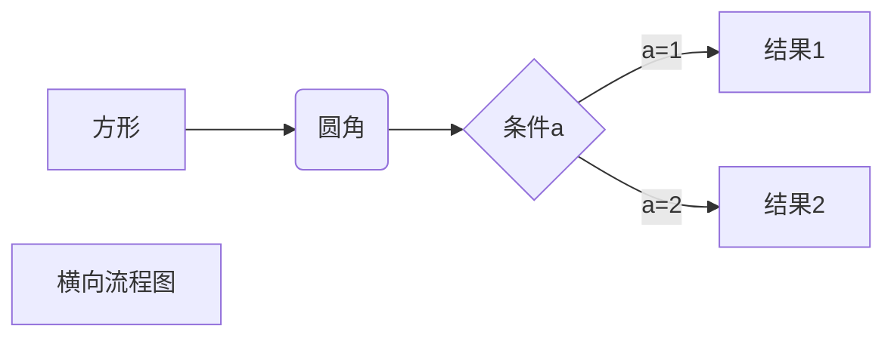
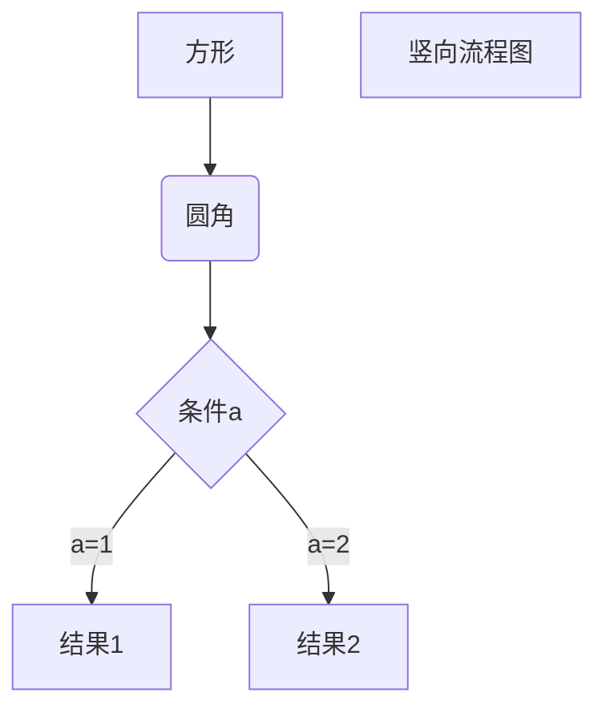
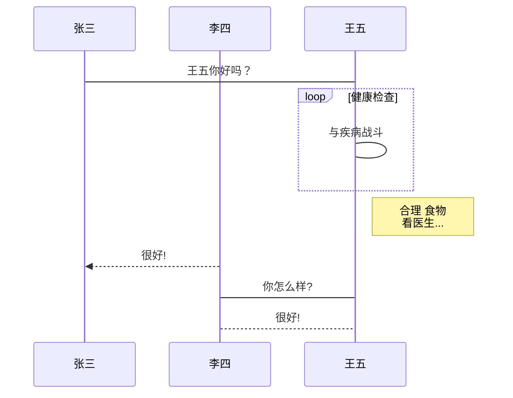
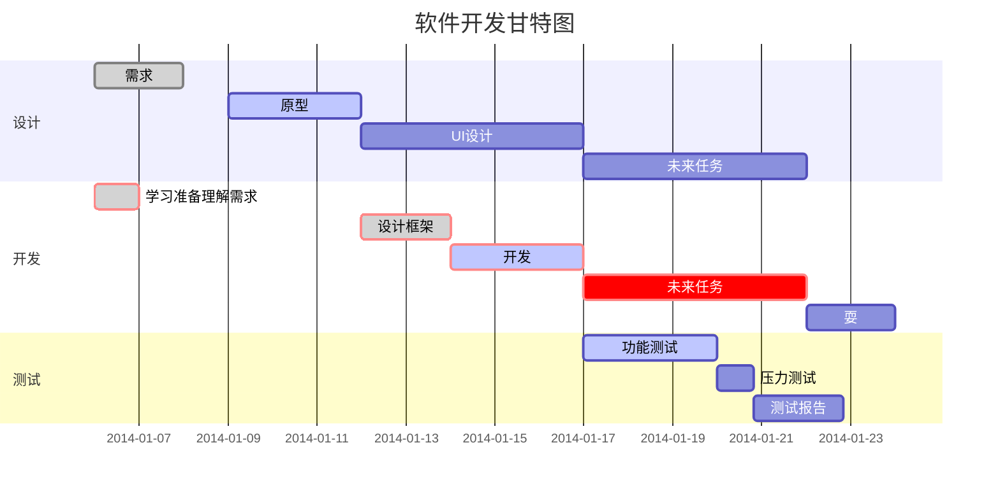

# Markdown

**归属：** 轻量级标记语言

**创始人：** 约翰·格鲁伯（英语：John Gruber）

**创建时间：** 公元纪年2004年

**文档后缀：** `.md` `.markdown`

**应用：** Gitbook、Blog……

**编辑器：** Typora、VSCode……


# 语法详解

## 标题

使用`#`号可以表示1-6级标题，`#`号的数量对应标题的级数，级数越小字体越小，层级越小

```markdown
 
 # 一级标题
 ## 二级标题
 ### 三级标题
 #### 四级标题
 ##### 五级标题
 ###### 六级标题
```


## 段落

**Markdown** 的段落没有特殊格式，这里主要介绍一下段落换行：

* 使用段落末尾加`两个以上空格` + `回车`
* 使用`空行`代表换行


## 字体

```Markdown

*斜体*
_斜体_
**粗体**
__粗体__
***粗斜体***
___粗斜体___
```


## 线条

* 分割线

```markdown

***
* * *
*****
- - -
-------
```

* 删除线

```markdown

~~删除线条~~
```

* 下划线

```html

<u>下划线</u>	<!--使用HTML语法中的<u>标签代替-->
```


## 脚注

```markdown

[^脚注]
[^脚注]: 脚注内容
```


## 列表

* 无序列表

  使用`*`号 `+`号 `-`号都可标记无序列表

```markdown

* 无序列表
+ 无序列表
- 无序列表
```

* 有序列表

```markdown

1. 有序列表1
2. 有序列表2
3. 有序列表3
```

* 列表嵌套

```markdown

1. 有序列表
    - 嵌套列表 	<!--在嵌套列表前面加上四个空格实现嵌套-->
```


##  引用

在段落前使用`>` 号实现区块引用

```markdown

> 区块引用
>> 区块嵌套一层
>>> 区块嵌套两层
```


## 代码

使用两个 <code>`</code> 号将段落中的代码引起来，实现代码显示

```markdown

使用`printf()`函数 	<!--使用代码-->
```


## 代码块

* 使用`四个空格`或`Tab键`
* 使用两个<code>```</code>扩起来并在后面制定语言，达成代码高亮

~~~markdown
	
	#include <stdio.h>
	int main(){
			printf("REDX");
			return 0;
	}
	
```php	<!--指定代码语言-->
	<? php
		echo "REDX";
	?>
```
~~~


## 链接

```markdown

[链接名称](链接地址)

<链接地址>

链接也可以用变量来代替，文档末尾附带变量地址：
这个链接用 `1` 作为网址变量 [Google][1]
这个链接用 `baidu` 作为网址变量 [BADIDU][baidu]
然后在文档的结尾为变量赋值（网址）

  [1]: http://www.google.com/
  [baidu]: http://www.baidu.com/
```


## 图片

```markdown


这个链接用 1 作为网址变量 [REDX][1].
然后在文档的结尾为变量赋值（网址）

[1]: http://www.baidu.com/images/redx-logo.png
```


## 表格

使用`|`分割单元格，使用`-`分割表头与内容

```markkdown

|  表头   | 表头  |
|  ----  | ----  |
| 单元格  | 单元格 |
| 单元格  | 单元格 |
```

使用`-:`表示右对齐，`:-`表示左对齐，`:-:`表示居中对齐

```markdown

| 左对齐 | 右对齐 | 居中对齐 |
| :-----| ----: | :----: |
| 单元格 | 单元格 | 单元格 |
| 单元格 | 单元格 | 单元格 |
```


## 公式

使用两个`$$`扩起来实现加载`Mathjax`渲染`TeX` `LaTex`格式的数学公式

```markdown

$$
\mathbf{V}_1 \times \mathbf{V}_2 =  \begin{vmatrix} 
\mathbf{i} & \mathbf{j} & \mathbf{k} \\
\frac{\partial X}{\partial u} &  \frac{\partial Y}{\partial u} & 0 \\
\frac{\partial X}{\partial v} &  \frac{\partial Y}{\partial v} & 0 \\
\end{vmatrix}
${$tep1}{\style{visibility:hidden}{(x+1)(x+1)}}
$$
```

输出：


## 流程图

~~~markdown


~~~

输出（横向流程图）：


~~~markdown


~~~

输出（竖向流程图）：


~~~markdown

```flow
st=>start: 开始框
op=>operation: 处理框
cond=>condition: 判断框(是或否?)
sub1=>subroutine: 子流程
io=>inputoutput: 输入输出框
e=>end: 结束框
st->op->cond
cond(yes)->io->e
cond(no)->sub1(right)->op
```
~~~

输出（标准竖向流程图）：


~~~markdown

```flow
st=>start: 开始框
op=>operation: 处理框
cond=>condition: 判断框(是或否?)
sub1=>subroutine: 子流程
io=>inputoutput: 输入输出框
e=>end: 结束框
st(right)->op(right)->cond
cond(yes)->io(bottom)->e
cond(no)->sub1(right)->op
```
~~~

输出（标准横向流程图）：


~~~markdown

```sequence
对象A->对象B: 对象B你好吗?（请求）
Note right of 对象B: 对象B的描述
Note left of 对象A: 对象A的描述(提示)
对象B-->对象A: 我很好(响应)
对象A->对象B: 你真的好吗？
```
~~~

输出（UML时序图）：


~~~markdown

```sequence
Title: 标题：复杂使用
对象A->对象B: 对象B你好吗?（请求）
Note right of 对象B: 对象B的描述
Note left of 对象A: 对象A的描述(提示)
对象B-->对象A: 我很好(响应)
对象B->小三: 你好吗
小三-->>对象A: 对象B找我了
对象A->对象B: 你真的好吗？
Note over 小三,对象B: 我们是朋友
participant C
Note right of C: 没人陪我玩
```
~~~

输出（UML时序图复杂）：


~~~markdown


~~~

输出（UML标准时序图）：


~~~markdown


~~~

输出（甘特图）：


## 高级

* 支持`HTML`标签
* 加上`\`转义字符

```markdown

\   反斜线
`   反引号
*   星号
_   下划线
{}  花括号
[]  方括号
()  小括号
\#   井字号
+   加号
-   减号
.   英文句点
!   感叹号
```

---

